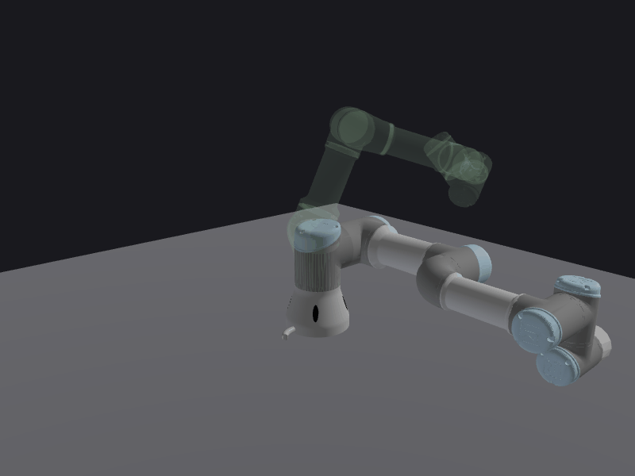

# Simple URDF Parser

A lightweight Python library for parsing, analyzing, and manipulating robot description files specified in the Unified Robot Description Format (URDF).


## Features

- Load and parse URDF robot description files.
- Access link and joint names, origins (RPY + XYZ), and hierarchy.
- Forward kinematics (FK) computation.
- Inverse kinematics (IK) with Jacobian pseudoinverse and Damped Least Squares iterative solvers.
- Jacobian computation for configurations.
- Singular configuration detection.
- Generate random joint configurations respecting joint limits.
- Example script for quick demonstration of functionality.

## Installation

Clone the repository and optionally install in editable mode:

```bash
git clone https://github.com/coenwerem/simple_urdf_parser.git
cd simple_urdf_parser
pip install -e .
```

Dependencies are listed in `requirements.txt` and include:

* `numpy`
* `spatialmath-python`
* `trimesh`
* `viser` (optional — for visualization)

## Usage

### Parsing a URDF
This snippet assumes the URDF file is located in the `assets/urdf` folder of this repository. Otherwise, provide the absolute path to your URDF file.

```python
from simple_urdf_parser.parser import Robot
import numpy as np
import spatialmath as sm

robot = Robot(desc_fp="../assets/urdf/ur3.urdf")

# List link and joint names
link_names = [link._name for link in robot.links]
joint_names = [joint.name for joint in robot.joints]
print("Links:", link_names)
print("Joints:", joint_names)

# Access joint origins (RPY + XYZ)
for joint in robot.joints:
    T = joint.origin.T
    print(joint.name, T.rpy(), T.t)
```

### Forward Kinematics

```python
q_test = robot.Configuration(
    joints=robot.actuated_joints,
    joint_values=[0, -np.pi/4, np.pi/4, 0, np.pi/3, 0]
)

T_fk = robot._compute_fk(
    config=q_test, 
    start=robot.base_link._name,
    end=robot.ee_link._name)
print("T_fk:", T_fk)
```

### Inverse Kinematics
The current version supports IK computation using the Jacobian pseudo-inverse (`method='jacinv'`) or Damped Least Squares (`method='dls'`) methods. Use it like so:
```python
ik_sol = robot._compute_ik(
    x_d=T_fk,
    init_guess=robot.Configuration.zeros_for_joints(robot.actuated_joints),
    method='jacinv',
    max_iters=200
)

# Verify
T_fk_sol = robot._compute_fk(
            config = robot.Configuration(
                    robot.actuated_joints,
                    joint_values=np.array(ik_sol.joint_values)
                    ))
print("IK solution:", np.round(np.array(ik_sol.joint_values), 3))
print("FK from IK solution:", T_fk_sol)
```

### Jacobian and Singularity Checks

```python
jac = robot._compute_jacobian(config=q_test)
print("Jacobian:\n", np.round(jac, 4))
print("Is singular:", q_test.is_singular(robot))
```

### Random Configuration Sampling

```python
q_rand = robot.Configuration.random_config(robot.actuated_joints, robot)
print("Random configuration:", np.round(qrand.joint_values, 4))
```

## Visualization

The library includes a [viser](https://viser.studio)-based 3D visualizer for interactive robot inspection and IK debugging.



<!-- TODO: replace with a screen-recorded video of the interactive viser demo -->

### Quick Start

```bash
pip install viser trimesh
python examples/demo_visualize.py
# Open http://localhost:8080
```

### Basic Viewer with Joint Sliders

```python
from simple_urdf_parser import Robot
from simple_urdf_parser.visualizer import RobotVisualizer

robot = Robot(desc_fp="assets/urdf/ur3.urdf")
viz = RobotVisualizer(robot, port=8080)

viz.build_scene()
viz.add_joint_sliders()
viz.server.sleep_forever()
```

### Interactive IK

Drag a 3D gizmo to set target poses — the robot solves IK and tracks in real time.

```bash
python examples/demo_ik_visualize.py --interactive
```

Or run the animated convergence mode with a ghost target:

```bash
python examples/demo_ik_visualize.py
python examples/demo_ik_visualize.py --target_xyz 0.2 0.1 0.3
```

## Examples

Run the included demos:

```bash
python3 examples/demo_parse_urdf.py          # parsing, FK, IK, Jacobian
python3 examples/demo_visualize.py            # 3D viewer with joint sliders
python3 examples/demo_ik_visualize.py          # animated IK convergence
python3 examples/demo_ik_visualize.py --interactive  # draggable IK gizmo
```

Sample output:

```
Links:
['base_link', 'base_link_inertia', 'shoulder_link', 'upper_arm_link', 'forearm_link',
 'wrist_1_link', 'wrist_2_link', 'wrist_3_link', 'base', 'flange', 'tool0']

Joint origins (RPY + XYZ) printed per joint...

T_fk:
  -0.5   -0.0  0.866  0.4565
   0.866  0.0  0.5    0.1533
   0.0    1.0 0.0    0.2388
   0      0   0      1

IK sol: [-0.0, -0.786, 0.786, -0.0, 1.047, -0.0]
T_fk (from IK): ...
Jacobian at q_test: ...
Random configuration: [-1.5766, 5.6638, 1.4577, 1.2398, -4.3226, -4.3229]
```

## Project Structure

```
simple_urdf_parser/
├── assets/urdf/            # Sample URDF files and meshes
├── examples/               # Demo scripts (parsing, visualization, IK)
├── simple_urdf_parser/     # Main library module
│   ├── parser.py           # URDF parser, FK, IK, Jacobian
│   └── visualizer.py       # Viser-based 3D visualization
├── tests/                  # Unit tests
├── pyproject.toml
├── requirements.txt
└── README.md
```

## Notes

* Mesh geometry (STL, DAE) is supported via `trimesh`. Visual origins from the URDF are applied correctly.
* The visualizer requires `viser` and `trimesh` (optional dependencies — the parser works without them).
* Designed for Python >= 3.9.
* Intended as a lightweight utility for robotics projects, simulation, and education.

## License

MIT License. See [LICENSE](LICENSE) for details.


## Issue Tracker

Bugs, feature requests, and other issues can be reported on the [GitHub Issues page](https://github.com/coenwerem/simple_urdf_parser/issues).

Please provide:

- A clear description of the problem or feature request.
- Steps to reproduce the issue.
- Relevant code snippets or URDF files.
- Python version and OS.

Detailed reports will be much appreciated to help improve the library!